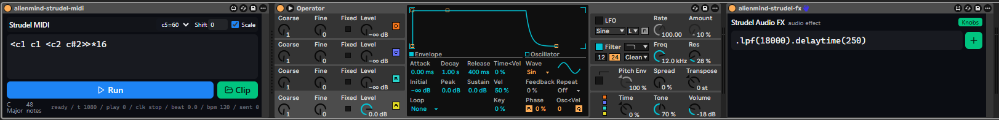
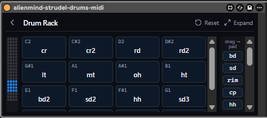

# m4l-strudel - A Hybrid Live Coding Experiment



This started as a fun experiment: *How cool is Strudel! Can I connect it to Ableton and control it from the Push to create the ultimate hybrid workflow?*

The result is a set of **Max for Live devices** that bring [Strudel](https://strudel.cc) - the JavaScript port of TidalCycles' pattern language - natively into Ableton Live. No browser tab, no virtual MIDI cables, no sync hacks: the real `@strudel/core` engine runs headlessly inside each device, locked to Live's transport, and fully mappable to Ableton Push for hands-on control!

> **New here? Start with the [user guide](doc/ABOUT.md)** - every control of every device explained.
> 
> **Note:** The pattern language is fully supported, but Strudel's *sound engine* is not. For a full list of what is supported and how it differs from the web version, see [doc/STRUDEL-SUPPORT.md](doc/STRUDEL-SUPPORT.md).

## What this project does

- **Generative sequencing in one line.** `note("c3 e3 g3 b3").sometimesBy(.3, x=>x.fast(2))` is a whole evolving part. Euclidean rhythms, polymeter, per-cycle alternation - things that are tedious to click into a piano roll are one expression in Strudel.
- **The ultimate hybrid workflow.** By exposing Strudel's engine states directly to Live, you can map them to your **Ableton Push** or external MIDI controllers. Start and stop complex algorithmic sequences with physical hardware!
- **A dedicated drum machine.** The new **Strudel MIDI Drums** device brings Strudel's generative drum language (`bd`, `sd`, `hh`) straight to your Ableton Drum Racks. It features a visual **Kit** mapper that natively persists in your Live set, letting you easily route algorithmic sequences to any custom kit!



- **It's really Live-native.** Patterns start on the bar, follow tempo automation, stop when you stop the transport, and notes land on the track the device sits on. Everything renders inside the device UI.
- **From sketch to clip.** The MIDI device can freeze any pattern into a regular MIDI clip (and read clips back into mini-notation), so generative sketches become ordinary arrangeable material. This works **inside an Instrument Rack too** - the device finds its track by climbing out of the rack chain, so clip import/export lands on the track the rack sits on. Where a track genuinely cannot be reached, both clip buttons disable themselves with a tooltip rather than failing silently.
- **Room to type, help that follows you.** A **Full Studio** floating window is a big editor over the same pattern as the device view (one pattern, one scheduler), and every Strudel-taking device has a `?` opening a pinned reference of exactly what THESE devices support - per device, offline, with an honest works / not-yet status on every entry, narrowing to whatever your caret is on.
- **A sample library browser with taste.** The community sample maps behind strudel.cc (hundreds of drum machines, folk instruments, found sound) become browsable, beat-synced-previewable, and downloadable straight into your User Library workflow.

## What's in the box

All four devices are ready to use.

| Device | Type | What it does for you |
|---|---|---|
| **Strudel MIDI** (`alienmind-strudel-midi.amxd`) | MIDI effect | Type a Strudel pattern, press **Run**, and it streams live MIDI into whatever instrument sits after it - tempo-locked to Live, following tempo changes, multi-channel via `.midichan()`. Scale-aware (it follows Live 12's key). Converts patterns **to and from MIDI clips** on the track (in a Rack too). A **macro-mappable Play/Stop** parameter (reveal it with the **Macro** button) lets a Rack macro or a Push button start and stop the sequencer. |
| **Strudel MIDI Drums** (`alienmind-strudel-midi-drums.amxd`) | MIDI effect | The exact same engine as Strudel MIDI, but purpose-built for driving Drum Racks. A dedicated mapping UI routes drum words (`bd`, `sd`, `hh`) to specific Drum Rack pads, and **the map travels with your set**. |
| **Strudel Audio FX** (`alienmind-strudel-fx.amxd`) | Audio effect | Write **one line** of Strudel's effect vocabulary - `.lpf(800).hpf(120).crush(8).gain(1.2)` - and it applies to whatever audio is already on the track. Nine stages (filter, hpf, drive, crush, delay, reverb, gain), each a real Live parameter: automatable, MIDI-mappable, native dials in the device view, and two named Push banks (Tone / Space). **Patterns modulate too**: `.lpf(sine.range(200, 2000))` sweeps the cutoff once per bar through `live.remote~` - continuous modulation, no automation written, and the dial comes back the moment the line stops asking. |
| **Strudel Sampler** (`alienmind-strudel-sampler.amxd`) | Instrument | A polyphonic drum-rack instrument: eight pads, one sample per pad, played by MIDI notes (C1..G1) into the track. Load a sound per pad from any Strudel sample map; overlapping notes ring out on independent voices, and two instances keep separate samples. |
| **Strudel Samples** (`alienmind-strudel-sample-browser.amxd`) | Audio effect | Browse Strudel's sample-map universe (dirt-samples, dough-samples, shabda, any `strudel.json` repo) and **audition samples through the track** - beat-synced to your project's launch quantization, looped in time, and heard through the track's own fader and effects. Auditioning downloads the file next to the device; drag it out into a Simpler, a Drum Rack or a track. |

**Ships with an Instrument Rack preset** (`presets/AlienMind Strudel Rack.adg`): Strudel MIDI -> a native Ableton instrument -> Strudel Audio FX, wired and ready to drop from Live's browser.

## Quick Examples

If you are eager to jump in, here are a few valid patterns you can drop straight into the respective devices to get started immediately:

**Strudel MIDI**
```js
<c1 c1 <c2 c#2>>*16
```

**Strudel MIDI Drums**
```js
s("bd hh sd hh")
```

**Strudel Audio FX**
```js
.lpf(800).gain(1.2)
```

## Download

You can download the pre-built `.amxd` devices ready for Ableton Live from:
- **[Download Latest Release](https://github.com/alienmind/m4l-strudel/releases/latest)**
- **[Gumroad](https://alienmindzzz.gumroad.com/l/m4l-strudel)** (might be outdated)

## Install

Once downloaded, simply extract the ZIP file and copy the `.amxd` devices into your Ableton **User Library** (e.g. `User Library/Max For Live/m4l-strudel/`).

Each `.amxd` is fully **self-contained** - its own React UI bundle (the Strudel engine only travels inside the MIDI devices, the only ones that need it) unpacks itself on first load. Drag from Live's browser onto a MIDI track (midi, midi-drums) or an audio track (sample-browser, fx) and go. Nothing ships loose beside the devices, and nothing runs a Node process.

*(For developers building from source, you can use `pnpm install:device` to automatically copy the compiled devices to your local Ableton User Library).*

## Build & test

```bash
pnpm install
git submodule update --init   # strudel/ - the engine is bundled from here
pnpm test          # vitest: mini-notation parser + headless engine tests
pnpm build         # → dist/m4l-strudel/alienmind-strudel-{midi,sample-browser,fx}.amxd
                    #   + dist/m4l-strudel.zip (release archive incl. installers)
pnpm dev:midi       # browser dev for the MIDI device, mocked Live beside it
pnpm dev:midi-drums # browser dev for the MIDI Drums device
pnpm dev:sample-browser # browser dev for the sample browser
pnpm dev:fx         # browser dev for the Audio FX device
```

For full details on building these devices with the underlying framework from scratch, read [doc/M4L-JWEB-GUIDE.md](doc/M4L-JWEB-GUIDE.md). Detailed architecture diagrams and concepts are found in [doc/ARCHITECTURE.md](doc/ARCHITECTURE.md).

## License

**AGPL-3.0-or-later**, matching [Strudel's own license](https://strudel.cc/technical-manual/project-start/). This project bundles the real `@strudel/core` engine (via the `strudel/` git submodule) and runs it directly, which makes it a derivative work under Strudel's AGPL terms. See [LICENSE](LICENSE) for the full text.
