# m4l-strudel

**Max for Live devices** that bring [Strudel](https://strudel.cc) - the JavaScript port of TidalCycles' pattern language - natively into Ableton Live. 

Bring generative sequencing, euclidean rhythms, and algorithmic composition directly into your Ableton Session.

[Download Latest Release](https://github.com/alienmind/m4l-strudel/releases/latest) | [Get it on Gumroad](https://alienmindzzz.gumroad.com/l/m4l-strudel) (might be outdated)

---

## New in 1.0.0

- **Live's transport drives the devices.** Launch a clip on a device's track, or just press Play, and the pattern starts; it stops when the transport does. No second button to remember.
- **The main instrument is simply called Strudel** (`alienmind-strudel`), and it plays LIVE - the real superdough engine runs inside the device, so an edit or a knob turn is audible immediately. It used to render offline and fade in at the next loop boundary; that whole pipeline is gone.
- **Strudel Synth**, a new device: type a SOUND rather than a pattern (`s("sawtooth").lpf(800).room(.3)`) and every MIDI note the track sends plays it.
- **Your sounds survive going offline.** Samples and sample maps are cached inside the device, so a set reopened with no network still plays what it played before.
- **One set of controls everywhere.** Every device's top bar now draws the same icon buttons, and the native knob panel is reachable from the device view rather than buried in About.

Known issues in this release: **Export** on the Strudel device fails to write its WAV (`could not place save`), and the **Copy folder path** button is therefore still untested. Both are first in line for 1.1.

---

## What's in the box

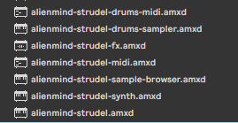

### The Main Instrument: Strudel

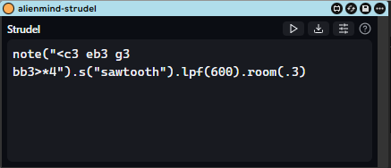

The primary deliverable is **Strudel** (`alienmind-strudel`, called `alienmind-strudel-superdough` before 1.0.0). This instrument understands the full Strudel language and uses the real `@strudel/superdough` engine to natively produce sounds (synths, oscillators, samples) and effects, perfectly in sync with Ableton's transport clock.

> ⚠️ **Experimental Limitations:** superdough now runs LIVE in the device, so edits and knob turns are audible immediately and there is no loop boundary to wait for. What remains:
> - **No MIDI in:** it sequences its own pattern rather than playing notes you send it. For that, use **Strudel Synth**.
> - **Freeze does not work:** Live freezes a track offline, and this device's sound comes from a live browser engine. Use **Export**, or resample the track.
> - **Timing can wobble:** the page's audio clock and Live's transport are two clocks, and a heavy set can pull them apart.

### The Micro Devices

We also deliver a set of specialized, lightweight devices - some translating Strudel into native Ableton MIDI or Max DSP, some making sound of their own:

| Device | Type, drop it on | What it does for you |
|---|---|---|
| **Strudel Synth** | Instrument, **MIDI track** | Type a SOUND (`s("sawtooth").lpf(800)`) instead of a pattern, and every MIDI note the track sends plays it. |
| **Strudel MIDI** | MIDI effect, **MIDI track** | Type a Strudel pattern, press **Run**, and it streams live MIDI into whatever instrument sits after it. Also converts patterns **to and from MIDI clips**. |
| **Strudel Drums MIDI** | MIDI effect, **MIDI track** | The same generative power as Strudel MIDI, focused on drums. Visual **Kit** mapper routes drum words (`bd`, `sd`) directly to Drum Rack pads. |
| **Strudel Drums Sampler** | Instrument, **MIDI track** | A code-driven drum sampler. Write `s("bd sd, hh*8")`, pick a drum machine **bank**, and it plays that machine's sounds. |
| **Strudel Audio FX** | Audio effect, **audio track** | Type a single line of Strudel's DSP effect vocabulary (e.g., `.lpf(800).gain(1.2)`) and it generates a real Max signal chain on the track. |
| **Strudel Samples** | Instrument, **MIDI track** | Browse Strudel's sample-map universe. Audition samples beat-synced to your project and drag them straight into a Drum Rack. |

They are meant to be combined. The chain below is the whole idea in one track: **Strudel MIDI** sequences the notes (`<c3 c3 <c3 c#3>>*16`), **Strudel Synth** turns each one into sound (`s("sawtooth")`), and **Strudel Audio FX** filters the result (`.lpf(6613)`). Every line is Strudel; every knob is a real, automatable Live parameter.

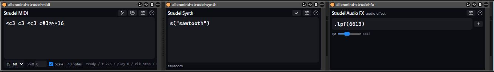

---

## Why a producer would care

- **Generative sequencing in one line.** `note("c3 e3 g3 b3").sometimesBy(.3, x=>x.fast(2))` is a whole evolving part. Euclidean rhythms, polymeter, per-cycle alternation - things that are tedious to click into a piano roll are one expression in Strudel.
- **It's really Live-native.** Patterns start on the bar, follow tempo automation, stop when you stop the transport, and notes land on the track the device sits on. 
- **From sketch to clip.** The MIDI device can freeze any pattern into a regular MIDI clip (and read clips back into mini-notation), so generative sketches become ordinary arrangeable material.
- **A sample library browser with taste.** The community sample maps behind strudel.cc (hundreds of drum machines, folk instruments, found sound) become browsable, beat-synced-previewable, and downloadable straight into your User Library workflow.

---

## Device Guide

### Strudel (`alienmind-strudel.amxd`)
Type any Strudel pattern - whether it's synthesizers like `s("sawtooth")`, samples like `s("bd")`, or complex effect chains. Press **Run** and start Live's transport. The pattern plays live, as real track audio: it goes through the fader, the sends and the meters like any other instrument, and you can resample or record it.

**One limitation worth knowing: Freeze does not work on this device.** Live's Freeze renders a track offline and faster than real time, and the device's sound comes from a live browser engine that cannot run in that offline pass - so a frozen track goes silent. This is a property of how Live freezes, not something the device can work around. Two things do work, and either gives you the same result:

- **Export** (the download icon) renders the pattern to a `.wav` next to the device. Use **Copy folder path** (the clipboard icon) to get the folder, paste it into Explorer/Finder, and drag the file onto an audio track.
- **Resample** the track onto an audio track while it plays, the normal Live way.

**Launching a clip on the track starts it.** You do not have to press Run as well: launch a clip on the device's track and the pattern starts; stop the clip and it stops. On a track with no clips at all, Live's global Play does the same job. Run and the mappable **Play/Stop** parameter still work, and whichever moved last wins.

### Strudel Synth (`alienmind-strudel-synth.amxd`)

The synth is the one device here that takes a **sound**, not a pattern. Type `s("sawtooth")`, add an envelope and effects (`.attack(0.2).lpf(800).room(.3)`), press the tick (or **Ctrl+Enter**), and every MIDI note the track sends plays that sound - from a clip, from your keyboard, or from a Strudel MIDI device sitting in front of it.

There is no Play/Stop here on purpose: the notes are the trigger, so there is nothing to start.

Two things to know:
- **Structure collapses.** `s("<sawtooth square>")` is a pattern, and this device keeps only its first event. Patterns belong in the main Strudel device.
- **Holding a key does not hold the note.** A note's length is decided when it starts, from `.sustain(seconds)` (0.6 s if you do not say). This is how the sound engine schedules a voice - the whole envelope goes in up front and cannot be cut short.

Any `slider()` in the sound (`.lpf(slider(1200, 100, 8000))`) binds to one of the eight native knobs (**S1..S8**), so you can automate the timbre or turn it from Push.

### Strudel MIDI (`alienmind-strudel-midi.amxd`)

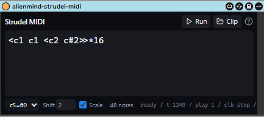

Two workflows in one device:
- **Live mode (Run / Stop)** - evaluate real Strudel code and stream the result as live MIDI into whatever instrument sits after the device.
- **Clip mode (Clip)** - convert mini-notation to a regular MIDI clip on this track, and read clips back into mini-notation.

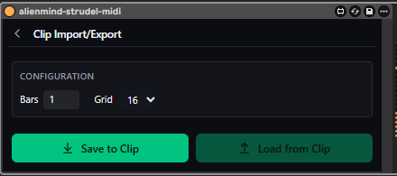

The editor features a **Full Studio** floating window, a native **Play/Stop** panel for macro-mapping, and a comprehensive **Help (?)** reference tailored to exactly what the device supports.

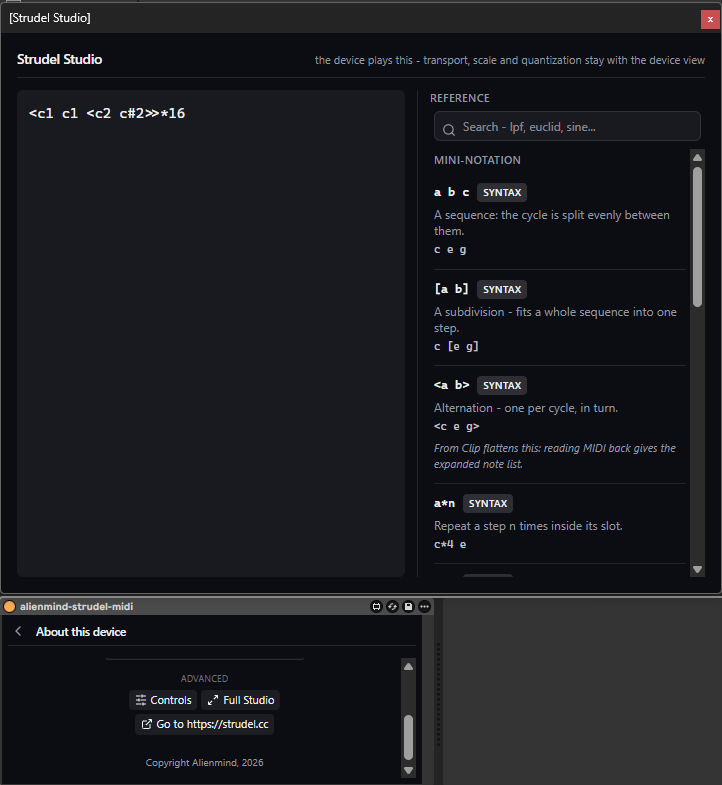
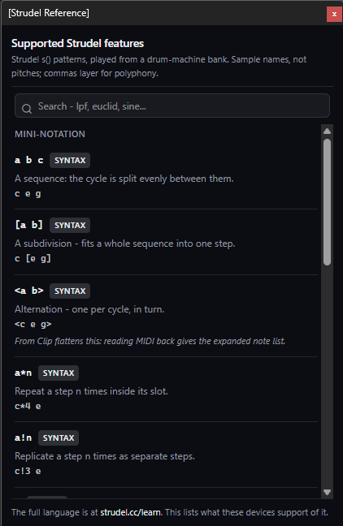

### Strudel Drums MIDI (`alienmind-strudel-drums-midi.amxd`)

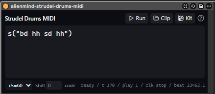

Built for driving Drum Racks. Instead of writing absolute pitches, write Strudel drum words (`bd`, `sd`, `hh`). 

Clicking the **Kit** button opens a dedicated visual mapper to route Strudel's vocabulary directly to your Ableton Drum Rack pads (e.g. assigning `bd` to note `36`). These mappings are stored natively and save with your Live set.

### Strudel Drums Sampler (`alienmind-strudel-drums-sampler.amxd`)

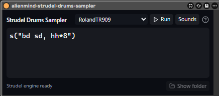

A self-contained instrument that fetches and plays samples from **drum-machine banks** driven by Strudel code. 

1. **Pick a bank** from the dropdown (e.g. RolandTR909, AkaiLinn).
2. **Write a pattern**: `s("bd sd, hh*8")`.
3. Samples **download automatically** in the background the first time a sound is named.

You can also browse the selected bank's sounds via the **Sounds** screen and audition them directly through the track.

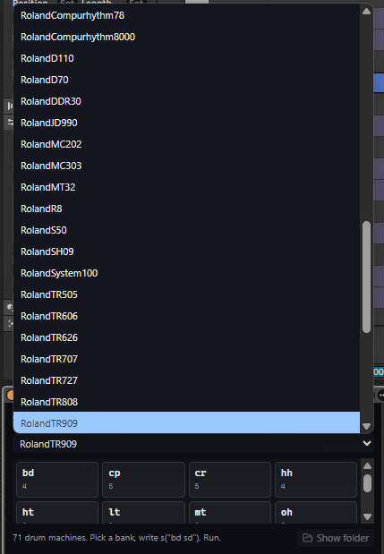

### Strudel Audio FX (`alienmind-strudel-fx.amxd`)

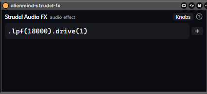

Brings Strudel's chainable DSP vocabulary to any audio track. Type a chain of Strudel effects, such as `.lpf(800).room(0.3).gain(1.2)`, and hit Enter. The parameters appear as **native Live dials** beside the text.

- **Native, not HTML**: the dials are real Live parameters - automatable, MIDI-mappable, and paged on Push.
- **Add Effect Menu**: clicking `(+)` opens an overlay to quickly append new DSP stages.

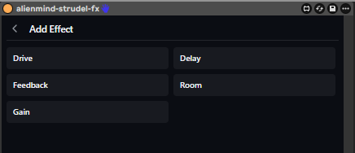

### Strudel Sample Browser (`alienmind-strudel-sample-browser.amxd`)

A browser for the community sample maps behind strudel.cc. Drop it on any audio track.
- Browse curated community sample maps (dough-samples, Dirt-Samples, clean-breaks).
- Audition samples beat-synced to your project's launch quantization.
- Drag the auditioned row straight into a Simpler, a Drum Rack, or an audio track.

---

## Troubleshooting

- **Updated the device but nothing changed** → Live embeds a copy of the device in your set when you drag it in. Delete the device from the track and re-drag it from the browser to update.
- **Run does nothing** → Check the status line says *Strudel engine ready* and remember: no sound until **Live's transport is playing**.
- **Red outline** → The message under the editor names the parse/eval error.
- **Load from Clip greyed out** → The track has no clips yet; Save to Clip makes one.
- **The sample list is empty after picking a map** → Check the status line for a fetch error (the maps come from the network).
- **No sound offline from `s("bd")`** → Samples are fetched when they play, so a sound has to have played online once. After that it is cached in the device and plays offline; synths (`s("sawtooth")`) never need the network.
- **The Synth is silent** → It plays incoming MIDI only. Check there is a clip or a controller sending notes to the track, and that the status line names your sound rather than showing a red error.