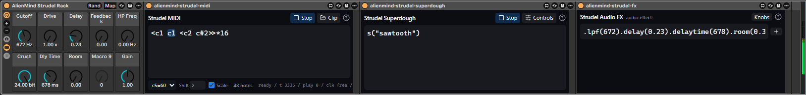

# m4l-strudel

**Max for Live devices** that bring [Strudel](https://strudel.cc) - the
JavaScript port of TidalCycles' pattern language - natively into Ableton
Live. No browser tab, no virtual MIDI cables, no sync hacks: the real
`@strudel/core` engine runs headlessly inside the MIDI device, locked to
Live's transport.

[Download Latest Release](https://github.com/alienmind/m4l-strudel/releases/latest) | [Get it on Gumroad](https://alienmindzzz.gumroad.com/l/m4l-strudel) (might be outdated)

---

**All four devices are ready to use.** The one thing still being verified in the
sample browser is whether Live accepts a sample dragged straight out of it - the
file is always on disk regardless (see that device's section). What is next is a
richer effects rack; see [doc/TODO.md](TODO.md).

## What's in the box

| Device | Type, drop it on | What it does for you |
|---|---|---|
| **Strudel MIDI** (`alienmind-strudel-midi.amxd`) | MIDI effect, a **MIDI track**, before an instrument | Type a Strudel pattern, press **Run**, and it streams live MIDI into whatever instrument sits after it - tempo-locked to Live, following tempo changes, multi-channel via `.midichan()`. Also converts patterns **to and from MIDI clips** on the track. |
| **Strudel Drums MIDI** (`alienmind-strudel-drums-midi.amxd`) | MIDI effect, a **MIDI track**, before a Drum Rack | The same generative power as Strudel MIDI, but focused purely on drums. It provides a visual **Kit** mapper to route drum words (`bd`, `sd`, `hh`) directly to specific Drum Rack pads. |
| **Strudel Drums Sampler** (`alienmind-strudel-drums-sampler.amxd`) | Instrument, a **MIDI track** | A code-driven drum sampler. Write `s("bd sd, hh*8")`, pick a drum machine **bank**, and it plays that machine's sounds - samples download automatically. Sixteen voices of polyphony; a MIDI sequencer in front can drive it too. |
| **Strudel Audio FX** (`alienmind-strudel-fx.amxd`) | Audio effect, any **audio track** | Type a single line of Strudel's DSP effect vocabulary (e.g., `.lpf(800).gain(1.2)`) and it generates a real Max signal chain on the track. Effects become native, automatable Live parameters. |
| **Strudel Samples** (`alienmind-strudel-sample-browser.amxd`) | Audio effect, any **audio track** (audio passes through) | Browse Strudel's sample-map universe (dirt-samples, dough-samples, shabda, any `strudel.json` repo) and **audition samples through the track** - beat-synced to your project's launch quantization and looped in time. Auditioning downloads the file next to the device; drag the row out into a Simpler or Drum Rack. |

Press **Run** and patterns play immediately on a free-running clock at the
project tempo; start **Live's transport** and they lock to the playhead,
start on the bar, and follow tempo changes.

It also **ships as an Instrument Rack** (`presets/AlienMind Strudel Rack.adg`): Strudel MIDI
-> a native Ableton instrument -> Strudel Audio FX, wired and ready to drag from Live's
browser as one device.

## Why a producer would care

- **Generative sequencing in one line.** `note("c3 e3 g3 b3").sometimesBy(.3, x=>x.fast(2))`
  is a whole evolving part. Euclidean rhythms, polymeter, per-cycle
  alternation - things that are tedious to click into a piano roll are one
  expression in Strudel.
- **It's really Live-native.** Patterns start on the bar, follow tempo
  automation, stop when you stop the transport, and notes land on the track
  the device sits on. Everything renders inside the device UI.
- **From sketch to clip.** The MIDI device can freeze any pattern into a
  regular MIDI clip (and read clips back into mini-notation), so generative
  sketches become ordinary arrangeable material. It is also a two-way way to
  *understand* a pattern: freeze a Strudel line you cannot quite read into a
  clip and **see** it in the piano roll, or drop a clip you already know and
  read its mini-notation - each side makes the other legible.
- **A sample library browser with taste.** The community sample maps behind
  strudel.cc (hundreds of drum machines, folk instruments, found sound)
  become browsable, beat-synced-previewable, and downloadable straight into
  your User Library workflow.

---

## Strudel MIDI (`alienmind-strudel-midi.amxd`)

Two workflows in one device:

- **Live mode (Run / Stop)** - evaluate real Strudel code and stream the
  result as live MIDI into whatever instrument sits after the device.
- **Clip mode (Clip)** - convert mini-notation to a regular MIDI clip on this
  track, and read clips back into mini-notation via a dedicated popup.

### The editor

Type your pattern in the big text box. For **Run** you can use full Strudel
code - `note("c3 e3 g3 b3").midichan(2)`, multiple `$:` lines, `stack(...)`,
`.fast()`, `.euclid()`, anything the Strudel engine evaluates. Bare
mini-notation like `c5 [e5 g5]*2` also works: Run wraps it in `note("...")`
for you. For **To Clip** the converter understands mini-notation (see the
table below).

The **`N notes` counter** (top right) shows how many notes the *clip
converter* currently parses out of your pattern - a quick validity check. A
red outline plus a message under the editor means a parse or eval error.

### Controls

| Control | What it does |
|---|---|
| **Bars** (1-8) | How many bars **To Clip** renders into the clip. One bar = one Strudel cycle, so patterns that change per cycle - like `<a5 b5>` (alternation) - need Bars >= 2 to capture all their variants in the clip. Does not affect live Run mode, which just keeps cycling. |
| **Grid** (8/16/32) | The quantization grid **From Clip** snaps to when turning clip notes back into mini-notation: 16 means each bar is read in 16th-note steps. Finer grid = more faithful to loose timing, but busier notation. Only affects From Clip. |
| **Octave** | Note-name convention. **Strudel (c5=60)** matches strudel.cc, where `c5` is middle C (MIDI 60). **Scientific (c4=60)** matches most DAWs/theory texts, where middle C is `c4`. Pick whichever matches how you think; it changes how names map to pitches in both directions. |
| **Shift** (-4...+4) | Transposes by whole octaves on top of the convention - e.g. Shift `-1` makes every written note sound an octave lower. Applies to clip conversion in both directions. |
| **▶ Run** | Sends the code to the embedded Strudel engine. Status shows *Pattern running*; notes start flowing when Live's transport plays. Press Run again anytime to hot-swap the pattern - the new one takes over on the next scheduling window. |
| **■ Stop** | Stops the running pattern and releases any held notes (Run reappears). Stopping Live's transport also silences everything. |
| **Clip** | Opens the secondary Clip export/import panel. |
| **Save to Clip** | Found in the Clip panel. Renders the pattern (using Bars/Octave/Shift) into a new Session clip named "Strudel" in the **first empty clip slot** of this track. |
| **Load from Clip** | Found in the Clip panel. Reads the **currently playing** clip on this track (or the first clip, if none is playing) back into mini-notation, quantized to Grid. Greyed out while the track has no clips. |

The **status line** at the bottom reports everything: engine ready, pattern
running, eval errors, notes written/read.

Clicking the device title opens the **About** screen, which holds an **Advanced** row so
the top bar stays uncluttered:

- **Controls** - reveals the native **Play/Stop** panel. That control is a real Live
  parameter, so you can map a **Rack macro** or a **Push button** to it and start/stop the
  sequencer from hardware. The native **Back** switch on the panel returns to the editor.
- **Full Studio** - opens a larger floating editor over the same pattern (one pattern, one
  scheduler; the window edits, the device plays) - shown above.
- **Go to https://strudel.cc** - opens the full web playground in a floating window.

Every Strudel-taking device also has a **?** (top right) that opens a pinned, offline
reference of exactly what THESE devices support - per device, honest works / not-yet status
on every entry, narrowing to whatever your caret is on:

### Typical flow

1. Drop the device on a MIDI track, put an instrument after it.
2. Wait for *Strudel engine ready* in the status line.
3. Type `note("c3 e3 g3 b3")`, press **Run**, start Live's transport.
4. Iterate live: edit the code, press Run again. Route lines to different
   instruments with `.midichan(n)` + separate tracks monitoring this one.
5. Happy with a part? Open the **Clip** panel, set **Bars**, press **Save to Clip**, and arrange the clip
   like any other MIDI. Or edit the clip in the piano roll and pull it back
   with **Load from Clip**.

### Mini-notation reference (clip converter)

| Feature | Example | Meaning |
|---|---|---|
| Sequence | `c5 e5 g5` | equal division of one cycle |
| Subdivision | `[e5 g5]` | nested equal division |
| Rest | `~` | silence |
| Repeat / speed | `[e5 g5]*2` | repeat the group twice in its slot |
| Elongation | `c5@3 e5` | c5 takes 3x the weight |
| Alternation | `<a5 b5>` | one element per cycle |
| Stack (chord) | `[c5,e5,g5]` | parallel notes |
| Polymeter | `{c5 e5, g5 b5 d6}%4` | 4 steps/cycle per layer |
| Euclid | `c5(3,8)` | 3 pulses over 8 steps (Bjorklund) |
| Raw MIDI | `60 64 67` | note numbers |

Live **Run** mode is not limited to this table - it evaluates full Strudel.

---

## Strudel Drums MIDI (`alienmind-strudel-drums-midi.amxd`)

This device runs the exact same engine as Strudel MIDI, but is purpose-built for driving Drum Racks. Instead of writing absolute pitches or scale degrees, you write standard Strudel drum words (`bd`, `sd`, `hh`) which are automatically translated into Drum Rack pad triggers.

### Visual Kit Mapping

Clicking the **Kit** button opens a dedicated visual mapper. This lets you route Strudel's vocabulary directly to your Ableton Drum Rack. For example, if you have a kick on pad C1, you simply assign `bd` to `36`. 

- **Custom words**: You can type any non-note text string (e.g. `clap2`) and assign it to a pad.
- **Persistence**: These mappings are stored natively, meaning your kit setup saves and loads automatically with your Ableton Live set.

---

## Strudel Drums Sampler (`alienmind-strudel-drums-sampler.amxd`)

Where Drums MIDI sends notes to *your* Drum Rack, the Drums Sampler is a self-contained
instrument: it plays the sounds itself, from a **drum-machine bank**, driven by Strudel
code. Drop it on a MIDI track (it is an instrument - nothing after it needed).

### How it works

1. **Pick a bank** from the dropdown - a classic drum machine (RolandTR909, AkaiLinn, ...),
   the same set strudel.cc calls with `bank()`.
2. **Write a pattern** on the **CODE** screen: `s("bd sd, hh*8")`. The names are drum
   sounds; the bank decides which machine's `bd`/`sd`/`hh` you hear. Commas layer for
   polyphony. A bare `bd sd, hh!6` works too - it is wrapped in `s(...)` for you. Press
   **Run**.
3. Samples **download automatically** in the background the first time a sound is named
   (from the same community repos the sample browser uses). The very first hit of a new
   sound is silent while it fetches, then plays from the next cycle; after that it is
   instant.

- **Per-hap bank**: `s("bd sd").bank("AkaiLinn")` overrides the dropdown inside the pattern.
- **MIDI in**: a MIDI sequencer (or the Drums MIDI device) in front of the Sampler plays
  the bank too - notes map to drum sounds by the standard Drum Rack layout (C1 = `bd`, ...).
- **Sounds screen**: browse the selected bank's sounds as tokens (with variation counts);
  click one to audition it through the track.
- **Sixteen voices**: overlapping sounds ring out independently; two instances keep
  separate samples. **Full Studio** is under **About > Advanced**, as on the other devices.

---

## Strudel Samples (`alienmind-strudel-sample-browser.amxd`)

A browser for the community sample maps behind strudel.cc. It is an **audio
effect**: put it anywhere on an audio track; incoming audio passes through
untouched and previews are mixed in, **through the track** - the fader, the
monitor cue and any effect after it all apply.

| Control | What it does |
|---|---|
| **Map dropdown** | A curated list of community sample maps (dough-samples, Dirt-Samples, clean-breaks, and ~30 more from strudel.cc's universe). Picking one **loads it at once** - there is no separate Load button. Choose *Custom...* to open a screen where you paste your own `github:user/repo`, a direct URL, or a `shabda:query`. |
| **Search** | Filters the list as you type. A sample map is 100+ sounds; the arrow keys walk the matches and audition as they go. |
| **A row** | **Click it (or arrow onto it) to hear it.** That also downloads it - reading a sample requires putting it on disk, so auditioning *is* acquiring; there is no separate download. A *pitched* badge marks multisampled instruments; the duration and a *mono* tag show once it has loaded. |
| **◀ n/N ▶** | Steps through a sound's variations (like `bd:3` in Strudel), auditioning each. |
| **Preview timing** | The audition starts on Live's **launch quantization** (the transport-bar setting) and **loops in time** - the loop is the sample rounded up to whole bars, so it restarts on a downbeat. Press **■** to stop. |
| **Drag handle (⋮⋮)** | Once a row has been auditioned, **drag the row** into a Simpler, a Drum Rack or a track. (Dragging a real file straight out of the embedded browser into Live's audio lane was tried and does not work - Max's Chromium strips the payload - so the file is your handle: it is on disk in `samples/` next to the device, drag it from there.) |
| **Show folder** | *Meant to* open the `samples/` folder in Finder/Explorer. **Known issue (1.0.0):** the OS reveal does not fire on any device yet, so for now open `samples/` next to the device by hand. |

**Flow:** pick a map → search and arrow through it until something fits → the
file is already on disk in `samples/` beside the device → drag the row out.

---

## Strudel Audio FX (`alienmind-strudel-fx.amxd`)

A genuine **audio effect** that brings Strudel's chainable DSP vocabulary to any audio track.

Type a chain of Strudel effects, such as `.lpf(800).room(0.3).gain(1.2)`, and hit Enter. The parameters your line names appear as **native Live dials** beside the text - and the line redraws from them, so a dial turn, an automation lane and a keystroke never fight.

- **Native, not HTML**: the dials are real Live parameters - automatable, MIDI-mappable, and paged on Push as two named banks (Tone / Space). The **Knobs** button (top right) reveals the full native panel.
- **Add Effect Menu**: clicking `(+)` opens an overlay listing the available DSP stages (`drive`, `delay`, `room`, ...), so you can append one without writing it.

*Note: The effect chain order is canonical and frozen at build time (e.g. filter → drive → delay → reverb → gain) to keep the Max DSP graph stable. Writing `.room(0.5).lpf(800)` produces the same signal path as `.lpf(800).room(0.5)`.*

---

## Troubleshooting

- **Updated the device but nothing changed** → Live embeds a copy of the
  device in your set when you drag it in; reinstalling the `.amxd` does NOT
  update instances already on tracks. Delete the device from the track and
  re-drag it from the browser. The device's footer shows the UI version, and
  the Max console prints the build stamp - compare them after updating.
- **Run does nothing** → check the status line says *Strudel engine ready*
  and remember: no sound until **Live's transport is playing**. The Max
  console (device Edit button) logs every boot step (`strudel: ...`).
- **Red outline** → the message under the editor names the parse/eval error.
- **Load from Clip greyed out** → the track has no clips yet; Save to Clip makes one.
- **The sample list is empty after picking a map** → check the status line for a
  fetch error (the maps come from the network).
- **A sample downloads but will not preview** → it is probably not a WAV. The
  preview reads the file into Max's `[buffer~]`, which takes WAV and AIFF and
  **not MP3**; the browser greys out what it knows it cannot play, and the Max
  console (device Edit button) has the rest.
- **Preview plays but the track's fader does not move it** → that is a bug, and
  worth reporting. The preview is deliberately routed *through* the track, so the
  fader, the monitor cue and any device after it all apply.

More depth: [README](../README.md) (includes how this project relates to the
[m4l-jweb](https://github.com/alienmind/m4l-jweb) library it's built on) and
[Architecture](ARCHITECTURE.md) (build pipeline, message protocol,
upstream-Strudel policy).
